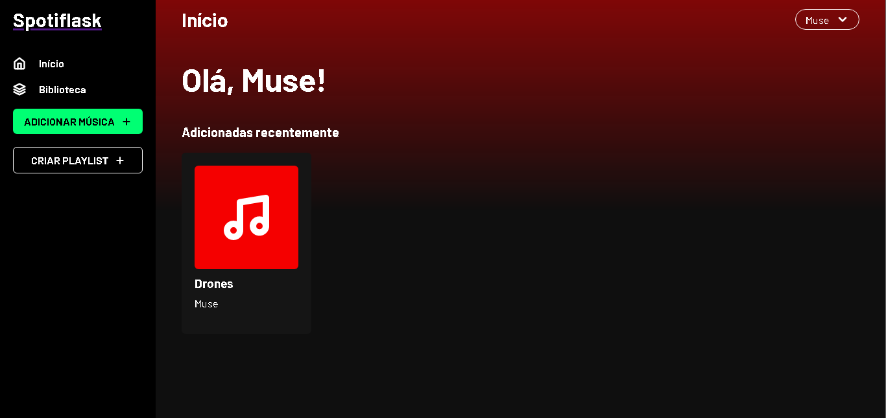
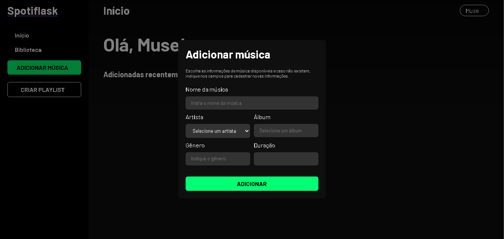
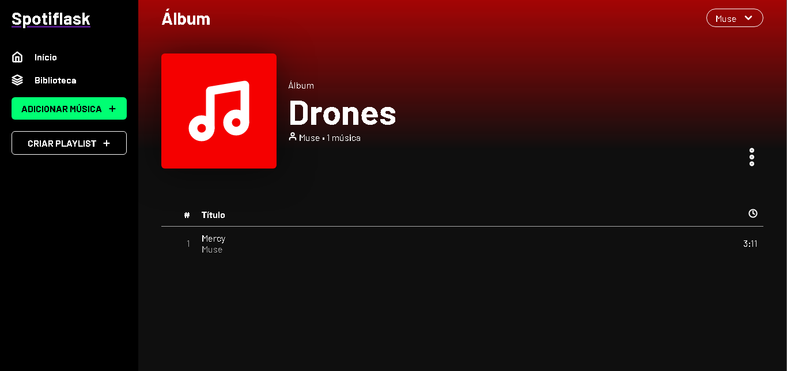
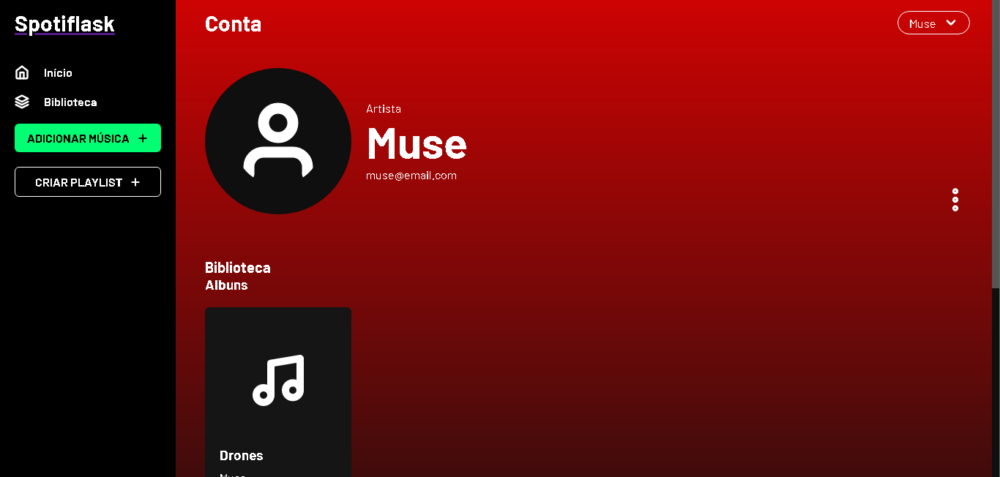

# 
Clone do Spotify feito com Flask para o curso de extensão do ecossistema Ânima.

## Introdução
O Spotiflask foi feito utilizando a framework Flask com a linguagem Python, aproveitando dos recursos da biblioteca para apresentar telas construídas pela biblioteca Jinja por meio de requisições HTTP.

Este projeto é um exemplo de CRUD com funções replicadas do Spotify, com possibilidade de criação de músicas, álbuns, playlists e artistas. As entidades do banco de dados são controladas pelo framework SQLAlchemy, na sua versão integrada ao Flask, e armazenadas num banco SQLite.

## Primeiros passos
Para utilizar o Spotiflask, é preciso possuir a versão 3 do Python instalada.

Além disso, é preciso instalar as dependências deste projeto especificadas no arquivo ``requirements.txt`` na raíz deste repositório.

Após possuir as dependências preparadas, inicie o terminal de comandos na raíz do repositório e rode o projeto com o comando:
```bash
flask --app . run
```

> 📘 O projeto acompanha um arquivo de banco de dados ``.sqlite3``, contendo as entidades criadas e alguns dados mockados para teste. Porém, se necessário, é posível remover este arquivo e iniciar um novo banco de dados seguindo os passos abaixo.

### Iniciando um novo banco
- Encerre o app se estiver rodando.
- Remova o arquivo de banco de dados ``/spotiflask.sqlite3``
- Rode o app novamente.
- Acesse a rota ``/usuario/cria`` para rodar os comandos de criação de um novo banco.

## Utilização
Ao iniciar o Spotiflask, para executar as funções essenciais do projeto, é preciso estar logado.

Para criar uma nova conta no sistema, é possível acessar a rota de login por meio do botão no canto superior direito da tela, e depois clicando em "cadastre-se".

A fim de criar músicas, é preciso que um artista esteja cadastrado, para isso, especifique no momento do cadastro de uma nova conta que o usuário sendo cadastrado é um artista.

Os álbuns são criados automáticamente ao criar uma nova música, desde que o álbum especificado não exista ainda.

## Imagens




